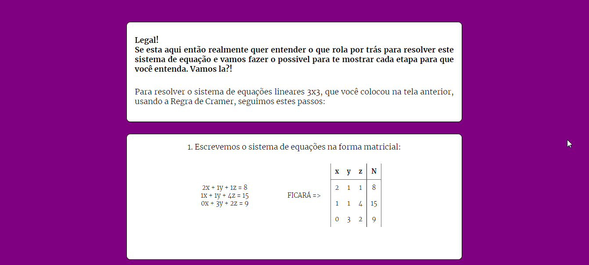

# Calculadora de Equações Lineares 3x3

Este é um projeto desenvolvido por Aline Fernanda Ponzani como parte do Programa de Pesquisa do Senac (PICTA - Programa de Pesquisa do Senac), sob a orientação do professor Alexandre Saron. O objetivo deste projeto é criar um site interativo para resolver equações lineares e apresentar o passo a passo da resolução, proporcionando uma ferramenta educativa para os alunos do curso de Análise e Desenvolvimento de Sistemas do Senac.

## Visão Geral do Projeto

O **Calculadora de Equações Lineares 3x3** é um site desenvolvido utilizando as tecnologias web HTML, CSS e JavaScript. Ele oferece uma plataforma onde os alunos podem inserir equações lineares e receber respostas precisas, além de visualizar como cada etapa da resolução é executada. Esse recurso busca aprimorar a compreensão dos alunos sobre o processo de resolução de equações lineares, auxiliando no aprendizado de matemática de forma interativa.

## Funcionalidades Principais

- **Resolução de Equações Lineares:** Os alunos podem inserir os valores das incógnitas da equação e o site irá calcular e apresentar as soluções correspondentes.

    

- **Passo a Passo da Resolução:** Além do resultado final, que será apresentado instataneamente na **Tela Inicial**, o site da ao usuário a opção de visualizar cada passo da resolução da equação, detalhando as operações realizadas em cada etapa.

    

- **Interface Intuitiva:** A interface do site é projetada de forma intuitiva e amigável, tornando fácil para os alunos inserirem os dados necessários e visualizarem as resoluções.

## Tecnologias Utilizadas

- **HTML:** A linguagem de marcação é usada para criar a estrutura básica do site, incluindo os elementos de entrada para as equações na tela inicial e a área de exibição dos resultados na segunda tela.

- **CSS:** O estilo visual do site é definido com CSS, garantindo uma apresentação agradável e responsiva em diferentes dispositivos.

- **JavaScript:** A programação JavaScript é utilizada para realizar os cálculos das equações inseridas, gerar o passo a passo da resolução com uma animação para auxiliar melhor o entendimento de que parte do processo deve ser realizada primeiramente e atualizar dinamicamente a interface.

## Como Utilizar o Site

1. Acesse o site através do link **https://alieponzani.github.io/Iniciacao_Cientifica/**.

2. Insira os valores na área designada ao lado de cada incógnita, se não houver nenhum valor (Ex: x + y + z = 6) deverá ser colocado 1 no campo (Ficará: 1 + 1 + 1 = 6) e se não houver uma das incógnitas o campo deverá ser completado com o 0.

3. Clique no botão "Calcular" para obter o resultado e a visualização do passo a passo da resolução.

4. Analise cada etapa da resolução para entender como a equação foi resolvida passo a passo.

## Agradecimentos

Agradeço à faculdade Senac e ao professor Alexandre Saron por me proporcionarem a oportunidade de desenvolver este projeto como parte do Programa de Pesquisa do Senac. Sua orientação e apoio foram fundamentais para o sucesso deste trabalho.

## Contato

Se tiver alguma dúvida, sugestão ou feedback, sinta-se à vontade para entrar em contato comigo pelo seguinte e-mail: [seu endereço de e-mail].

---

*Nota: Este é um documento README fictício criado com base nas informações fornecidas. Certifique-se de substituir os espaços reservados ([seu nome], [insira o link aqui], [seu endereço de e-mail], etc.) pelas informações reais antes de adicionar este arquivo ao seu repositório no GitHub.*